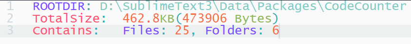
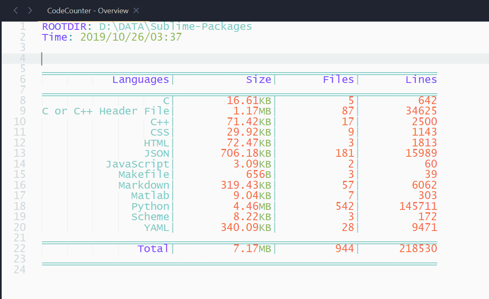
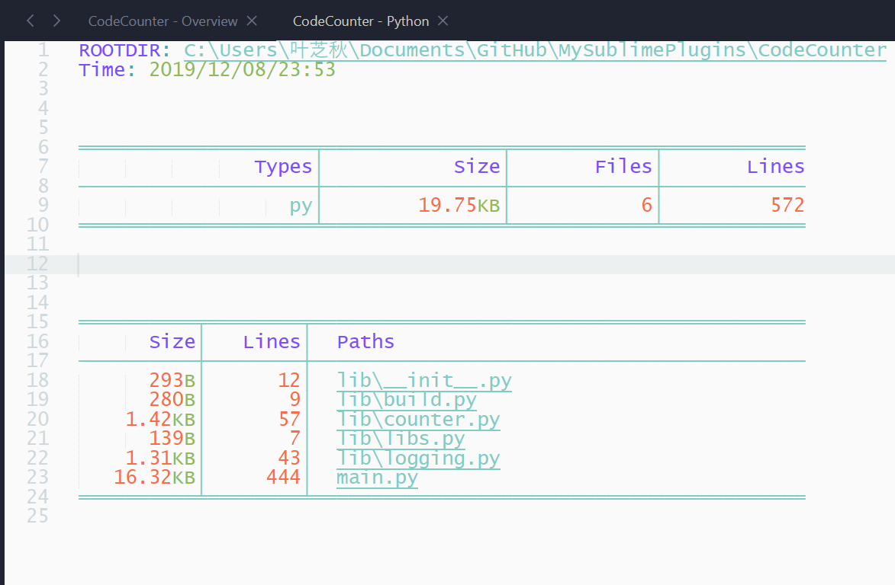

[![License][license-image]](/LICENSE)
[![Downloads][packagecontrol-image]][packagecontrol-link]


# CodeCounter
[English](README.md)

## 这个插件是做什么用的？
这个插件是为**Sublime Text**编写的， 它的功能正如它的名字所表达的那样。


## 安装
首先，你需要将这个插件下载解压或者在`git`的帮助下克隆到你的**Sublime Text**的插件目录。
当然，如果在此之前你已经安装了**PackageControl**（并且可用：-），推荐使用它来帮你安装。记住插件的名字叫做**CodeCounter**。


## 功能一览
- 三个 `侧边栏菜单`
   * Files Size
   * Code Counter
   * Code Counter Filtered

- 两个实用的`命令`
   * CodeCounter: count dir
   * CodeCounter: count dir filtered


## 使用方法

侧边栏菜单适用于那些已经被挂在到侧边栏的文件夹和喜欢用鼠标的人，按下快捷键<kbd>ctrl+shift+p</kbd> 进入到`命令面板`中，输入并执行`命令`被认为是 sublime 的非常强大和方便的功能，强大到什么地步？不可替代！

- 侧边栏菜单详解
    * `Files Size` 统计文件夹或文件的大小，结果高亮显示在`panel`中，如下。
      

    * `Code Counter` 列出一个文件夹（或文件）的统计信息，结果显示在一个`View`中，如下图所示。
      

    * `Code Counter Filtered` 像`Code Counter`一样， 只不过会在开始统计之前要求你输入一个`模式`（容稍后再详加解释）。

- 命令详解
    * `CodeCounter: count dir` 要求你输入一个存在于你的操作系统上的路径，然后做和`Code Counter`一样的工作。
    * `CodeCounter: count dir filtered` 要求你输入一个存在于你的操作系统上的路径， 然后做和`Code Counter Filtered`一样的工作。

### 视图里面的操作
在一个`Overview`视图中，双击一个语言名会打开一个新的视图，用来展示那门语言的详细的统计结果， 你也可以通过将光标移动到你想要了解的语言的名字的范围内，然后按 <kbd>d</kbd> 或 <kbd>enter</kbd> 键来查看它。 暂且将新进入的视图称作`详情视图`， 它看起来就像下面这样。


在一个`详情视图`中， 双击文件路径会打开对应的文件，如同前面一样，快捷键<kbd>o</kbd> and <kbd>enter</kbd> 可以为你带来帮助。


## Pattern inputting
<!-- 考虑做成相对根目录的路径，因为根目录可能包含了`pattern` -->
模式是用来筛选那些你不想让它们出现统计结果中的文件的，绝对路径中包含了你输入的`模式`的文件不会被计入统计结果。


### 一个例子
假设有像下面这样结构的一个目录
```
/root/a/...
     /b/...
     /c/...
     /d.txt
```
你想要以`root`为根目录统计代码量， 但是想把子目录`b`排除在外，所以你想输入一个模式来排除子目录`b`下的所有文件，`Code Counter Filtered` 可以帮助你达成目的。

在你按下菜单 `Code Counter Filtered` 或者输入命令 `CodeCounter: count dir filtered` 并且输入了一个文件路径之后，插件会要求你输入一个模式，那么此时你应该输入`/b/`（所有平台通行） 或者 `\b\`（仅适用于 Windows）来达到目标。 如果你想排除 `/b/` 和 `d.txt`，考虑输入 `/b/;d.txt`。

### 特定模式
一些特定字符会被转义以生成适当的正则不表达式。
- `;` 被用来分隔模式，可以被正则表达式中的 `|` 代替。
- `*` 被当做 正则表达式中的 `.*` 对待。
- `file.ext` 只匹配 `file.ext`。


## 设置
```json
{
    "encoding": "utf-8",
}
```
请设置正确的编码`encoding`，以正确识别操作系统上的文件路径，否则文件无法打开，统计结果有误。

其他设置
```json
{
    "extensions": {
        "language's name": ["language's extensions1", ]
    },

    "fullnames": {
        "Make" : ["Makefile", ]
    }
}
```


## 问题
- 双击语言名字总是会新建一个视图，即使存在一个之前打开的同样的视图。


[Issue](https://github.com/absop/CodeCounter/issues)

[license-image]: https://img.shields.io/badge/license-MIT-blue.svg
[packagecontrol-image]: https://img.shields.io/packagecontrol/dt/CodeCounter.svg
[packagecontrol-link]: https://packagecontrol.io/packages/CodeCounter
