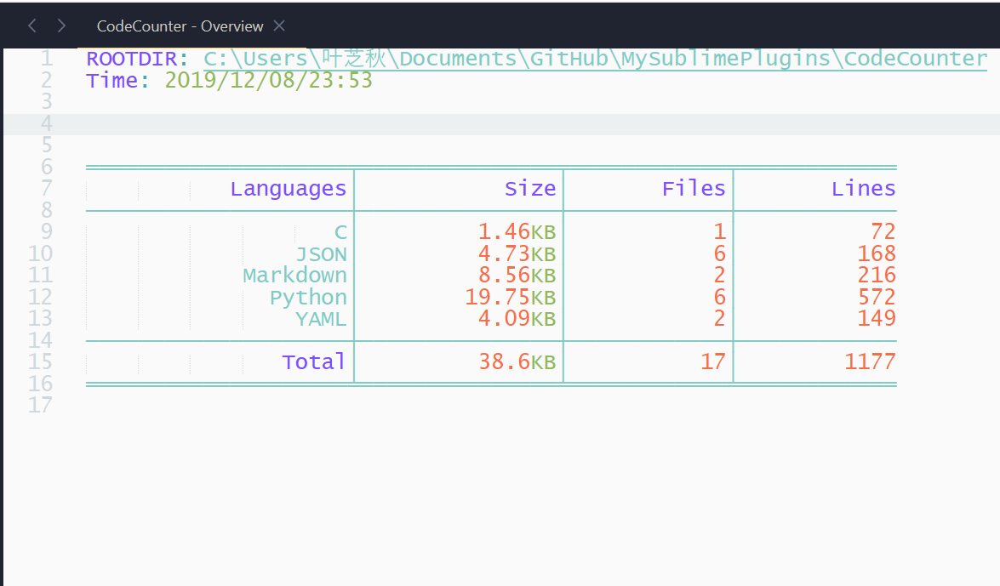
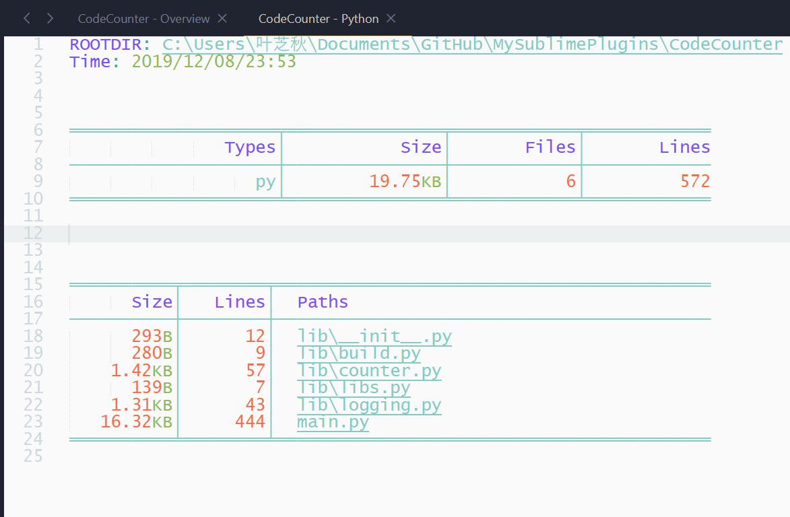

![License][license-image]

# CodeCounter
[中文](Chinese.md)

## What is this plugin for?

This is a plugin written for **Sublime Text**, its function as its name suggests.

## How to use?

First you need to clone this plugin into your packages path.
<!-- Or if `Package Control` has been installed in your *Sublime Text*, just use it. -->
After the first step has done, open your *sublime text* and click a side bar folder(if there are not, <kbd>alt+p</kbd> and <kbd>d</kbd> to add one), then you can see two new items on the menus. They are `File Size` and `Code Counter`.

Click `File Size` will count the size of that folder, and click `Code Counter` show you some statistic infomation for your, about that folder contains source code.

Statistic result is shown in a `View` as below,

Double-click a language name will open a new **View** to show the detail statistic result for that language, you can also move cursor into the region of the language name you want to view, and press down <kbd>d</kbd> or <kbd>enter</kbd> to view it.

When you click a language name, you will see a view like below.

In the new view, you can see each code file's `size`, `lines` and `path` relative to the `ROOTDIR`, each path of files are highlighting shown with a underline. Double-click a path will open its corresponding file, also, you can use hotkeys, they are <kbd>o</kbd> and <kbd>enter</kbd>.

## Some Problems Currently

- Double-click the language name will always create a new view, even if there has one the same exists.
- In a `Overview` view, after you double-click a language name and get into a new view, back to the `Overview` view, you will find that couldn't use the keyboard to move the cursor. I think this is probably a bug of **Sublime Text** itself. If you have more knowledge about this, please let me know (zlang2099@163.com), thanks!

[Issue](https://github.com/absop/CodeCounter/issues)

[license-image]: https://img.shields.io/badge/license-MIT-blue.svg
